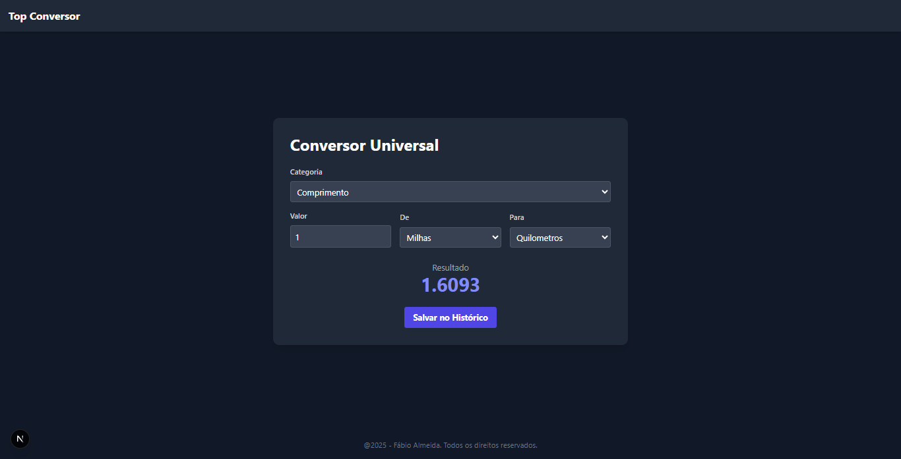

# 🚀 TOP Conversor


Um aplicativo web moderno, rápido e responsivo para conversão de unidades, construído com Next.js e Tailwind CSS.

Este projeto foi desenvolvido como um aplicativo de portfólio para demonstrar habilidades em desenvolvimento front-end, gerenciamento de estado com React Hooks e boas práticas de engenharia de software.


---

## ✨ Funcionalidades principaís

* **Múltiplas Categorias:** Converte facilmente unidades de:
    * Comprimento (Metros, Quilômetros, Milhas, Pés)
    * Peso (Gramas, Quilogramas, Libras)
    * Temperatura (Celsius, Fahrenheit, Kelvin)
* **Cálculo em tempo real:** Os resultados são atualizados instantaneamente enquanto você digita.
* **Histórico de conversão:** Salve suas conversões mais usadas com um único clique para referência futura.
* **Exportação de dados:** Exporte todo o seu histórico de conversão para um arquivo `.csv` e abra-o no Excel ou Google Sheets.
* **Design responsivo:** UI limpa e totalmente funcional em desktops, tablets e celulares.

## 🛠️ Tecnologias utilizadas

Este projeto foi construído utilizando as seguintes tecnologias:

* **Framework:** [Next.js](https://nextjs.org/) (React)
* **Estilização:** [Tailwind CSS](https://tailwindcss.com/)
* **Linguagem:** JavaScript (ES6+)
* **Deploy:** [Vercel](https://vercel.com/)

## Como executar o projeto localmente

Siga os passos abaixo para rodar o projeto em sua máquina local.

### Pré-requisitos

* [Node.js](https://nodejs.org/en/) (Versão 16.x ou superior)
* [Git](https://git-scm.com/)

### Passos

1. **Clone o repositório:**
    ```bash
    git clone [https://github.com/almeida89/top_conversor.git](https://github.com/almeida89/top_conversor.git)
    ```

2. **Navegue até a pasta do projeto:**
    ````bash
    cd top_conversor
    ```

3. **Instale as dependências:**
    ```bash
    npm install
    ```

4. **Inicie o servidor de desenvolvimento:**
    ```bash
    npm run dev
    ```

5. Abra [http://localhost:3000](http://localhost:3000) no seu navegador para ver a aplicação funcionando!

## 🌐 Deploy na Vercel

Este projeto está 100% otimizado para deploy na [Vercel](https://vercel.com/), a plataforma criadora do Next.js.

O processo é "zero-config":
1. Envie seu código para o seu repositório no Github.
2. Crie uma conta na Vercel e importe o repositório.
3. Clique em **"Deploy"**. A Vercel detectará automaticamente que é um projeto Next.js e fará todo o processo de build e deploy para você.

## 📄 Licença

Este projeto está licenciado sob a **Licença MIT**.

Isso significa que você é livre para usar, copiar, modificar, mesclar, publicar, distribuir e/até vender cópias do software.

Veja o arquivo [LICENSE](./LICENSE) para mais detalhes.